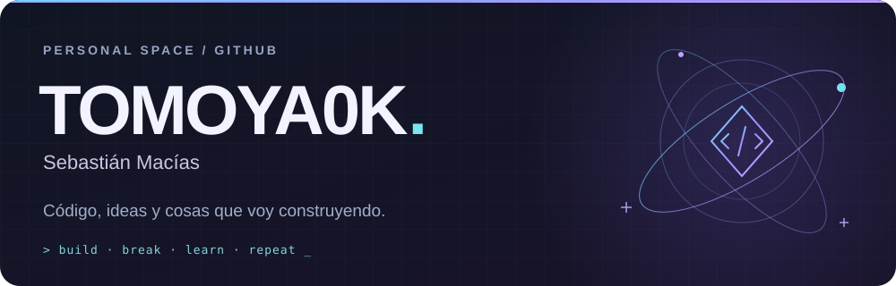
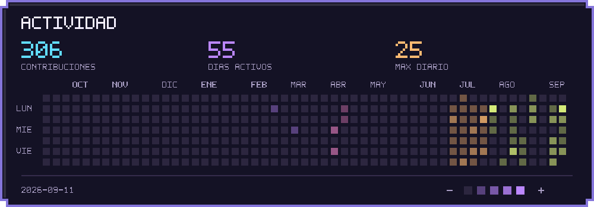
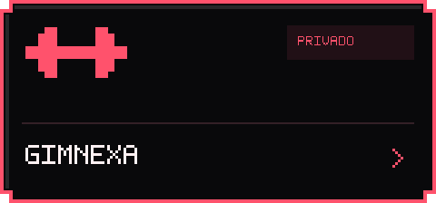
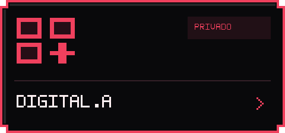
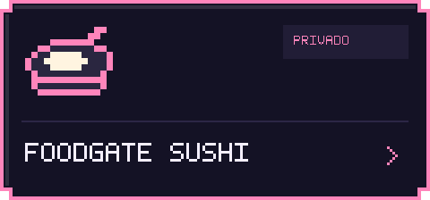
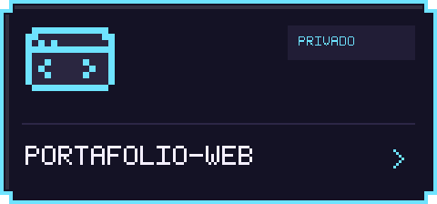
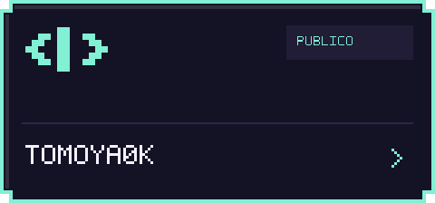
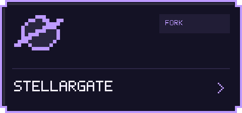
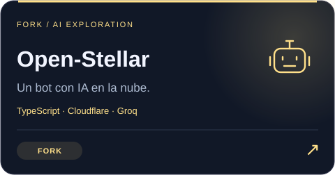
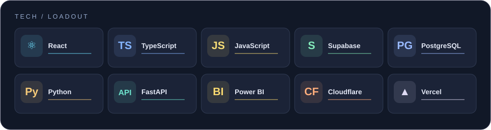

  

  <strong>Crear. Romper. Entender. Volver a crear.</strong> 
  Interfaces, aplicaciones y experimentos. Este es mi pequeño rincón de internet.

  <a href="https://portafolio-web-eta-six.vercel.app/">↗ Portafolio</a>
  &nbsp; / &nbsp;
  <a href="https://github.com/Tomoya0k?tab=repositories">⌘ Repositorios</a>

### ◈ Activity spectrum

  

Una versión personalizada de mi actividad pública. La fecha de la imagen indica su última actualización; el calendario original de GitHub se conserva debajo del perfil.

### ◉ Project collection

<table>
  <tr>
    <td width="50%"></td>
    <td width="50%"></td>
  </tr>
  <tr>
    <td width="50%"></td>
    <td width="50%"></td>
  </tr>
</table>

  

Los proyectos privados forman parte de mi colección, pero su código sigue siendo privado. Sus enlaces requieren acceso. Mi <a href="https://portafolio-web-eta-six.vercel.app/">portafolio sí se puede visitar</a>.

### ⌘ Forks / explorations

<table>
  <tr>
    <td width="50%"></td>
    <td width="50%"></td>
  </tr>
</table>

Proyectos originales: <a href="https://github.com/StellarGateLabs/StellarGate">StellarGateLabs/StellarGate</a> y <a href="https://github.com/Bitcoindefi/Open-Stellar">Bitcoindefi/Open-Stellar</a>. Los forks no son proyectos originales míos.

### ⚡ Tech loadout

  

  
<strong>Un poco sobre mí</strong>

Soy **Sebastián**, por aquí **Tomoya0k**. Voy construyendo aplicaciones, interfaces, herramientas y alguna que otra idea que terminó convirtiéndose en un repositorio.

Me gusta que lo que hago funcione bien **y también se vea chulo**.

---

  Siempre hay algo por pulir, aprender o empezar. 
  <strong>✦ &nbsp; TOMOYA0K &nbsp; ✦</strong>

